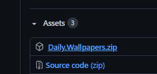
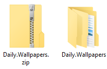
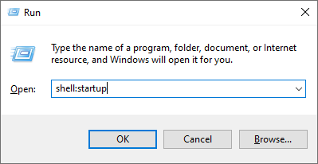
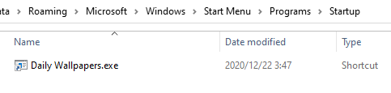

# DailyWallpapers
This console application checks for daily images from Bing's API and sets the desktop wallpaper.

 

### How To Install

The installation is very simple.
All you need to do is head over to <a href="https://github.com/kageroukw/DailyWallpapers/releases">the releases</a> and download the latest `DailyWallpapers.zip` file.

  

Once it's downloaded, extract the zip to a folder.

  

That's it! Open the folder and run `DailyWallpapers.exe`. Your desktop wallpaper will now be changed to today's wallpaper.

 

#### Add To Startup

Press Windows Key + R, then type `shell:startup`.

  

Drag and drop `DailyWallpapers.exe` in the folder.

  

You successfully added the app to your computer's startup. Every time your computer starts up, the console will appear for a quick moment and then disappear.
